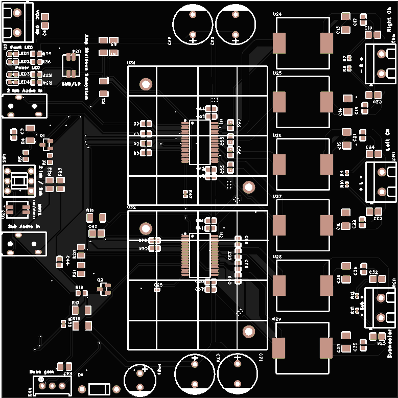
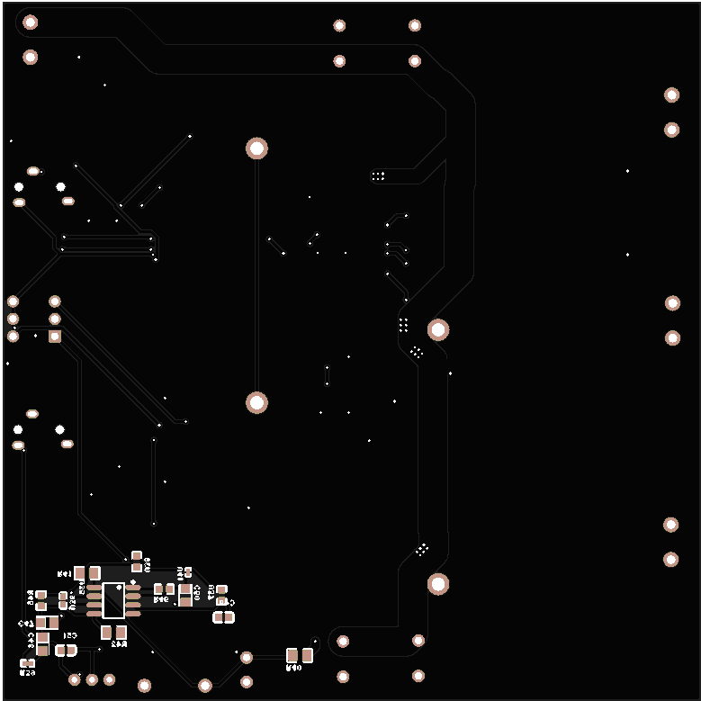

## Texas Instruments TPA3156 Amp

This project showcases a 2.1-channel class D amplifier design with a separate bass input. I'm proud of this project as it was my first CAD and PCB design. While this project uses a typical class D amplifier, the configuration is not standard:

* It uses two TPA3156 class D amplifier circuits, with one configured as a typical 2.1 channel amplifier and the other in a mono BTL configuration.
* The TPA3156 chip has an output of 75 watts per channel and 140 watts in mono BTL configuration.
* For the 2.1 channel configuration, the left and right channels are connected to one chip and the subwoofer output to the other. The audio signals in the 2.1 channel mode are routed through an op-amp, which acts as an active low-pass filter.
* There's a pushbutton to switch the mode from 2.1 channel to separate output to the mono BTL amplifier. This bypasses the low-pass filter and uses a dedicated 3.5 mm input jack.

# Because it's my first project there might be some errors or room for imrovment feel free to use or contrbute in this project :) peace

[Open Interactive BOM](https://minha-d.github.io/Texas-Instruments-TPA3156-Amp/)
